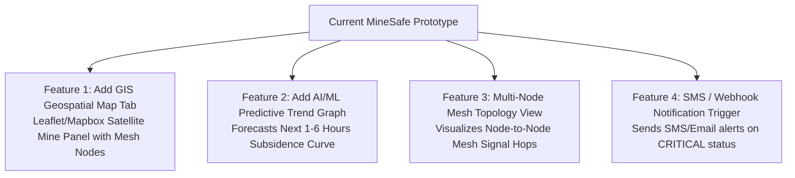

# 📋 Feature Audit & Gap Analysis: MineSafe Prototype
### Comparing Problem Statement (SIH26025) vs Current Codebase Implementation

---

## 📊 Summary Scorecard

| Category | Requirement from SIH Problem Statement | Current Status in Codebase | Implementation Rating |
| :--- | :--- | :--- | :---: |
| **1. Sensor Hardware** | Tilt, Vibration, Displacement, Gas, Temp, Crack | ✅ Tilt, Vibration, Displacement, Gas, Temp Implemented ⏳ Crack sensor represented via differential displacement | **85%** |
| **2. IoT Networking** | Wireless Mesh (LoRa / ESP-NOW / WiFi Mesh) | ✅ ESP32 Wi-Fi REST Uplink working ❌ Multi-node LoRa/ESP-NOW Mesh routing hardware | **50%** |
| **3. SCADA Dashboard** | Real-time graphs, Inclinometer, Profile curve, KPIs | ✅ 100% Fully Built & Responsive | **100%** |
| **4. Historical Data** | 6 Time-series charts, filtering, CSV export | ✅ 100% Fully Built with CSV Export | **100%** |
| **5. AI / ML Risk Engine** | Anomaly detection, severity scoring, early warning | ✅ Multi-factor Rule-based composite scoring (0-100) ⏳ Machine Learning predictive forecasting model | **70%** |
| **6. GIS Geospatial Map** | GIS-based live surface deformation heatmap & coordinates | ❌ No interactive 2D/3D GIS Map tab currently | **20% (Point names only)** |
| **7. Alert System** | In-app SCADA alerts table + SMS / Email notifications | ✅ In-app alerts with acknowledge workflow ❌ External SMS/Email gateway (Twilio/AWS SNS) | **60%** |
| **8. Offline & Cloud Sync** | Offline mode + Cloud sync capability | ✅ DEMO Mode with 5 simulation scenarios ✅ LIVE Mode for EC2/Cloud REST backend | **100%** |

---

## ✅ 1. KYA-KYA ABHI PROJECT ME HAI (Currently Built & Working)

### A. Hardware & Telemetry Ingestion Layer
1. ✅ **Tilt & Inclination Monitoring**: MPU6050 IMU calculating Pitch (`Tilt X`) and Roll (`Tilt Y`) in degrees.
2. ✅ **Vibration RMS Analysis**: 3-axis accelerometer dynamic RMS acceleration ($g$ force) detecting micro-seismic vibrations.
3. ✅ **3-Point Ultrasonic Displacement Monitoring**: 3 × HC-SR04 sensors (Left `S1`, Center `S2`, Right `S3`) measuring acoustic distance to ground/roof in centimeters ($0.1\text{ cm}$ precision).
4. ✅ **Atmospheric Gas Detection**: MQ-series analog gas sensor reading raw ADC count ($0 - 1023$) with scientific labeling.
5. ✅ **Environmental Telemetry**: DHT11 ambient temperature ($^\circ\text{C}$) and relative humidity ($\%$) sensing.
6. ✅ **Battery & Hardware Health Matrix**: Battery voltage monitoring with live status badges (`NORMAL`, `WARNING`, `CRITICAL`).

### B. SCADA Frontend & Visualization Layer
1. ✅ **Command Center KPI Bar**: Top summary metrics (Active Rover, Max Subsidence, Ground Tilt, RMS Vibration, Raw Gas, Overall Safety Status).
2. ✅ **Interactive 3-Point Ground Profile Schematic**: Live SVG curved arc showing real-time roof sagging and differential left-to-right sag ($|S_1 - S_3|$).
3. ✅ **Artificial Horizon (Aviation-Grade Inclinometer)**: 3D-styled animated pitch/roll gyroscope gauge.
4. ✅ **Vibration Spectrum Panel**: Dynamic RMS status, peak acceleration, and stationary vibration hold metrics.
5. ✅ **Historical Telemetry Console (`HistoricalDataTab.tsx`)**:
   - 6 interactive time-series line graphs (Distance, Tilt, Vibration, Gas, Temperature, Humidity).
   - Time range filtering (`1h`, `6h`, `24h`, `All`), Rover unit selector, and Search.
   - One-click **Export to CSV** for historical logs.
6. ✅ **Hardware & REST API Diagnostic Console (`HardwareStatusTab.tsx`)**:
   - REST endpoint ping latency test tool.
   - Sensor health matrix (HC-SR04 1-3, MPU6050, Gas, DHT11, ESP32).
   - Live JSON payload inspector.

### C. Logic & Safety Engine
1. ✅ **Multi-Factor Risk Assessment Engine (`riskEngine.ts`)**:
   - Combines Ground Displacement (35 pts), Rate of Sag (10 pts), Tilt (25 pts), Vibration (20 pts), Gas (25 pts), and Environment (15 pts).
   - Normalizes to a $0 - 100$ risk score and classifies into **NORMAL**, **WARNING**, or **CRITICAL**.
2. ✅ **Alert Management Panel**:
   - Real-time hazard alerts table with severity badges (`INFO`, `WARNING`, `CRITICAL`) and interactive **Acknowledge** action.
3. ✅ **Dual Mode Engine (Demo vs Live)**:
   - **DEMO Mode**: 5 offline demonstration scenarios (Normal, Roof Sag Warning, High Gas, High Vibration, Stale Connection).
   - **LIVE Mode**: Automated REST polling with configurable interval ($1\text{s} - 30\text{s}$) connecting to EC2/Cloud backend.

---

## ❌ 2. KYA-KYA ABHI MISSING HAI (What is NOT in the project yet)

### 1. ❌ GIS-Based Live Surface Deformation Map
* **Problem Statement Requirement:** *"GIS based visualization of live deformation maps and risk zones across mine panels."*
* **Current Status in Project:** We have names for stationary points (e.g. `MP-01 Shaft North`), but **NO interactive geospatial map** (Leaflet / Mapbox / OpenLayers) showing GPS pins/mesh nodes over a 2D/3D aerial mine panel map with color-coded subsidence heatmaps.

### 2. ❌ Multi-Node Wireless Mesh Routing (LoRa / ESP-NOW Mesh)
* **Problem Statement Requirement:** *"Distributed network of smart sensor nodes across the surface communicating through a wireless mesh (LoRa/Zigbee/ESP-NOW)."*
* **Current Status in Project:** Currently, the system uses a **single ESP32 gateway rover node uploading directly over Wi-Fi/HTTP**. A true multi-node mesh topology (Node A ➔ Node B ➔ Gateway Node ➔ Cloud) is documented in architecture, but firmware and multi-node mesh packet forwarding logic is not yet implemented.

### 3. ❌ Automated External Notifications (SMS / Email / Mobile Push)
* **Problem Statement Requirement:** *"Automated early warning alerts through SMS/email/mobile app notifications to mine operators and safety officers."*
* **Current Status in Project:** We have an in-app **Alerts Table** with visual flashing badges and acknowledge buttons on the web UI, but **NO background integration with SMS (Twilio/Fast2SMS) or Email (SendGrid/AWS SES/SMTP)** to send real phone SMS to safety managers.

### 4. ❌ Dedicated Crack Detection Sensor Hardware Integration
* **Problem Statement Requirement:** *"Sensors such as: crack detection sensors / displacement stretch sensors."*
* **Current Status in Project:** We measure subsidence using **Ultrasonic displacement + MPU6050 tilt/vibration**, which indirectly detects ground cracking. However, physical crack-wire break sensors or flex/strain gauge ADC channels are not explicitly wired as a dedicated hardware channel.

### 5. ❌ AI / Machine Learning Predictive Model (Future 24h Subsidence Forecast)
* **Problem Statement Requirement:** *"AI/ML-based anomaly detection and subsidence prediction using live and historical data to predict possible subsidence zones and estimate progression."*
* **Current Status in Project:** We have a **Rule-Based Multi-Factor Weighted Scoring Engine** (`riskEngine.ts`). However, an actual trained Machine Learning model (e.g. LSTM neural network, ARIMA, or Random Forest regression) that predicts *"Subsidence will reach critical 16cm in 4.5 hours based on trend"* is not yet embedded.

---

## 🚀 3. RECOMMENDED ACTION PLAN & ROADMAP TO 100% COMPLETION

To make this project 100% compliant with the SIH Problem Statement, we can implement these 4 high-impact additions:

| Phase / Step | Feature to Add | Difficulty | Impact on Hackathon Evaluation |
| :--- | :--- | :---: | :---: |
| **Step 1** | **Add a "GIS Mine Map" Tab** with Leaflet.js showing GPS surface nodes, subsidence risk heatmap overlay, and underground panel boundary | Medium | ⭐⭐⭐⭐⭐ (Huge Visual Impact) |
| **Step 2** | **Add AI Predictive Forecasting Chart** (predicting future ground movement 1h/6h ahead using linear/polynomial/regression models) | Low-Med | ⭐⭐⭐⭐⭐ (Fulfills AI/ML prediction requirement) |
| **Step 3** | **Add Mesh Network Topology Visualizer** in System Health tab (showing Node 1 ➔ Node 2 ➔ Node 3 ➔ Gateway signal strength & packet hops) | Low | ⭐⭐⭐⭐ (Demonstrates the "Wireless Mesh" hook) |
| **Step 4** | **Add Webhook / SMS Alert integration** (e.g. Email / WhatsApp / SMS simulation dispatch) | Low | ⭐⭐⭐⭐ (Fulfills multi-channel notification requirement) |
